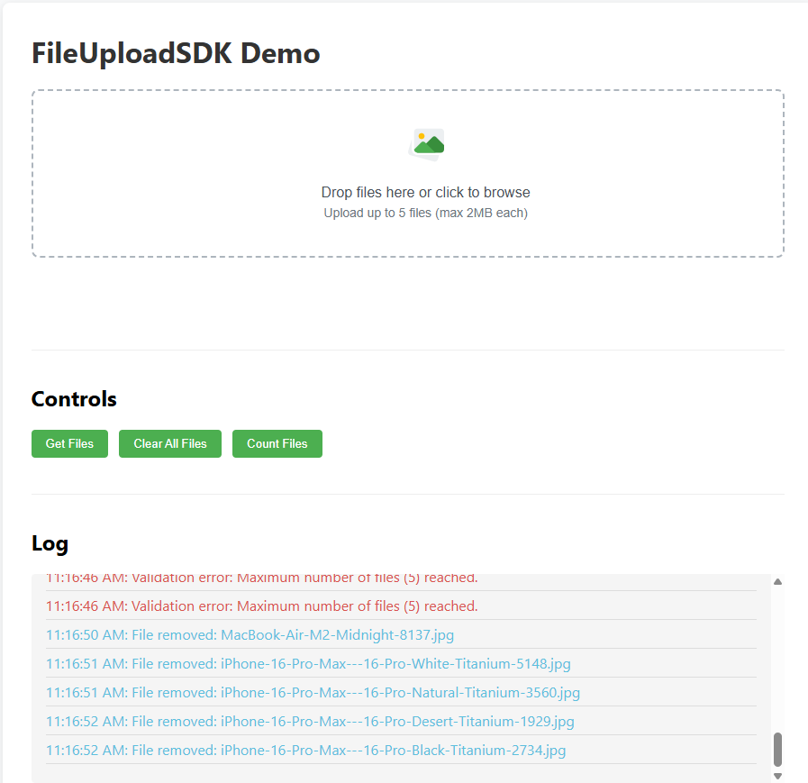

# FileUploadSDK

A lightweight, modern file upload library for web applications with drag-and-drop support, file validation, and preview generation.

[](https://rawcdn.githack.com/AmadulHaque/FileUploadSDK/main/index.html)

👉 **[Live Demo](https://rawcdn.githack.com/AmadulHaque/FileUploadSDK/main/index.html)**

## Features

- 📂 **Drag-and-drop** file upload with visual feedback
- ✅ **File validation** for type and size
- 🖼️ **Preview generation** for images and PDFs
- 🎨 **Customizable appearance** with options for labels and icons
- 🔄 **Event callbacks** to integrate with your application
- 📱 **Responsive design** that works on mobile and desktop
- 🚀 **Zero dependencies** - just include the JS file and go

## Installation

### Direct Download

Download the [file-upload-sdk.js](dist/file-upload-sdk.js) file and include it in your project.

## Quick Start

1. Include the script in your HTML:

```html
<!-- downloaded directly -->
<script src="path/to/file-upload-sdk.js"></script>
```

2. Add a container element to your HTML:

```html
<div id="my-uploader"></div>
```

3. Initialize the SDK:

```javascript
const uploader = new FileUploadSDK({
    containerId: 'my-uploader'
});
```

4. That's it! You now have a fully functional file uploader.

## Basic Example

```html
<!DOCTYPE html>
<html lang="en">
<head>
    <meta charset="UTF-8">
    <title>FileUploadSDK Basic Example</title>
</head>
<body>
    <h1>File Upload Example</h1>
    <div id="uploader"></div>
    
    <script src="file-upload-sdk.js"></script>
    <script>
        const uploader = new FileUploadSDK({
            containerId: 'uploader',
            maxFiles: 5,
            maxSizeMB: 2,
            onFileAdded: (file) => {
                console.log(`File added: ${file.name}`);
            }
        });
    </script>
</body>
</html>
```

## Configuration Options

Create a new FileUploadSDK instance with these configuration options:

```javascript
const uploader = new FileUploadSDK({
    // Required
    containerId: 'my-uploader',
    
    // Optional with defaults
    maxFiles: 10,
    maxSizeMB: 5,
    allowedTypes: [
        'image/jpeg',
        'image/png',
        'image/gif',
        'image/webp',
        'application/pdf',
        'image/svg+xml'
    ],
    labels: {
        dropText: 'Upload or drag and drop here',
        helpText: 'Max {maxFiles} files, size {maxSize}MB each. PNG, JPG, GIF, WEBP, PDF, SVG only.'
    },
    icons: {
        uploadIcon: '<svg>...</svg>', // Default icon is included
        pdfIcon: '📄'
    },
    
    // Event callbacks
    onFileAdded: (file) => {},
    onFileRemoved: (fileName) => {},
    onValidationFail: (error) => {}
});
```

### Configuration Reference

| Option | Type | Default | Description |
|--------|------|---------|-------------|
| `containerId` | String | - | **Required.** ID of the container element |
| `inputName` | array | [] | Add your input name |
| `maxFiles` | Number | 10 | Maximum number of files allowed |
| `maxSizeMB` | Number | 5 | Maximum file size in megabytes |
| `allowedTypes` | Array | [...] | Array of accepted MIME types |
| `labels.dropText` | String | 'Upload or drag and drop here' | Main text in upload area |
| `labels.helpText` | String | 'Max {maxFiles} files...' | Help text with placeholders for variables |
| `icons.uploadIcon` | String | (SVG string) | Upload area icon (SVG format) |
| `icons.pdfIcon` | String | '📄' | Icon used for PDF previews |
| `onFileAdded` | Function | - | Callback when file is added successfully |
| `onFileRemoved` | Function | - | Callback when file is removed |
| `onValidationFail` | Function | - | Callback when file validation fails |

## API Reference

### Methods

| Method | Parameters | Return | Description |
|--------|------------|--------|-------------|
| `getFiles()` | - | Array | Returns array of selected File objects |
| `clearFiles()` | - | void | Removes all files from the uploader |
| `addFiles(files)` | FileList or Array | void | Adds files programmatically |
| `removeFile(fileName)` | String | Boolean | Removes a file by name, returns success status |

### Examples

```javascript
// Get all currently selected files
const files = uploader.getFiles();

// Clear all files
uploader.clearFiles();

// Add files programmatically (e.g., from another input)
const input = document.querySelector('input[type="file"]');
uploader.addFiles(input.files);

// Remove a specific file
uploader.removeFile('image.jpg');
```

## Advanced Usage

### Form Submission

To submit files with a form:

```javascript
document.getElementById('my-form').addEventListener('submit', function(e) {
    e.preventDefault();
    
    const formData = new FormData(this);
    
    // Add all files from the uploader to the form data
    uploader.getFiles().forEach((file, index) => {
        formData.append(`files[${index}]`, file);
    });
    
    fetch('/upload', {
        method: 'POST',
        body: formData
    })
    .then(response => response.json())
    .then(data => console.log('Success:', data))
    .catch(error => console.error('Error:', error));
});
```

### Custom Styling

The SDK injects its own styles, but you can override them with your own CSS:

```css
/* Example of custom styling */
.file-upload-sdk-drag-drop-area {
    border: 2px dashed #3498db;
    border-radius: 12px;
}

.file-upload-sdk-drag-over {
    background-color: #d6eaf8;
}

.file-upload-sdk-preview-item {
    border-radius: 8px;
    box-shadow: 0 2px 5px rgba(0,0,0,0.1);
}
```

## Browser Support

FileUploadSDK works in all modern browsers:

- Chrome (latest)
- Firefox (latest)
- Safari (latest)
- Edge (latest)

Internet Explorer is not supported.

## License

MIT License

## Contributing

Contributions are welcome! Please feel free to submit a Pull Request.

1. Fork the repository
2. Create your feature branch (`git checkout -b feature/amazing-feature`)
3. Commit your changes (`git commit -m 'Add some amazing feature'`)
4. Push to the branch (`git push origin feature/amazing-feature`)
5. Open a Pull Request
